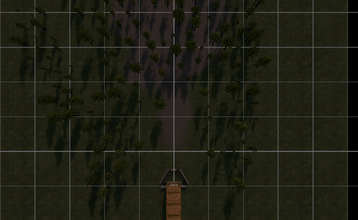
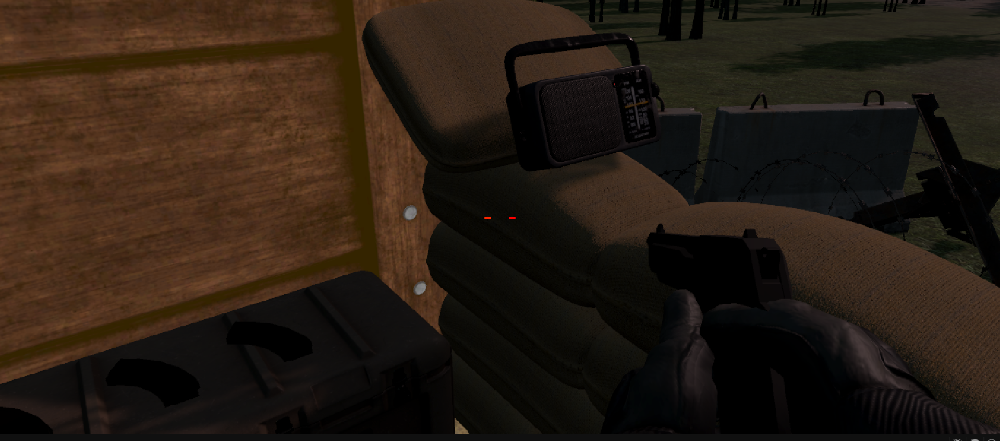
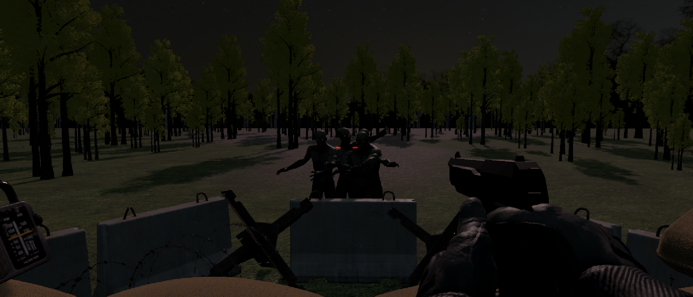
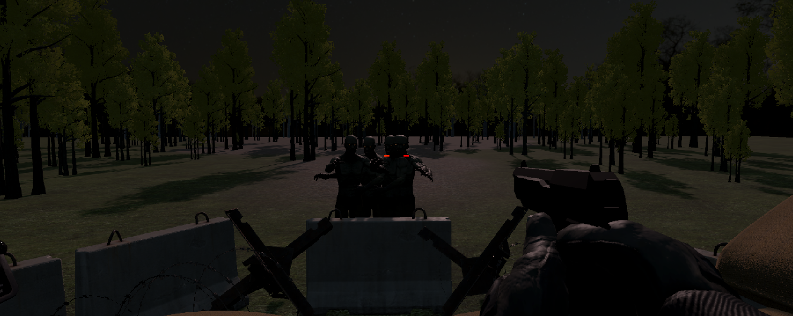
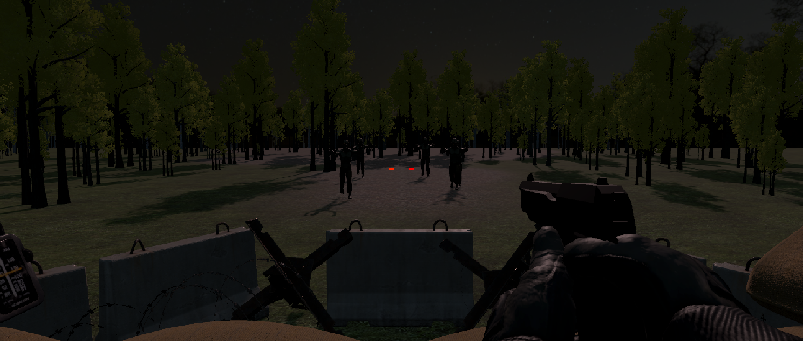

## 🧟 Breach: Last Outpost

Welcome to **Breach: Last Outpost** – a first-person zombie survival shooter built in Unity! Defend your bunker, survive relentless waves, and experience immersive gameplay with custom assets and realistic environments.

---

### 🎮 Game Overview

- **Genre:** First-Person Shooter / Survival
- **Engine:** Unity
- **Objective:** Defend your bunker against waves of zombies using your pistol and limited ammo.
- **Environment:** Realistic terrain, dynamic lighting, and custom models.

---

### 🚀 Features & Mechanics

- **Wave Spawning:** Zombies spawn in configurable waves, managed by the `ZombieWaveSpawner` script.
- **Zombie AI & Health:** Zombies react to damage, play hit/death animations, and become aggressive when attacked (`ZombieHealth`, `ZombieAI`).
- **Shooting System:** Fire, reload, and manage your ammo. Shooting triggers animations and sounds (`WeaponShoot`).
- **Aiming Down Sights:** Aim for precision with smooth FOV and crosshair transitions (`AimDownSight`, `WeaponAimOffset`).
- **Camera Look:** Mouse-driven camera for immersive aiming (`CameraLook`).
- **UI:** Ammo count displayed with TextMeshPro (`AmmoUIController`).

---

### 🗂️ Main Assets

- **Prefabs:**
	- Arms
	- Bunker
	- Pistol Bullet
	- Multiple zombie models
- **Terrain:** Realistic textures and layers
- **Audio:** Gunshot and reload sounds
- **Animations:** Shooting, reloading, zombie walking, running, dying

---

### 🖼️ Screenshots & Art

See below for in-game visuals and concept art:

---

### 📂 Project Structure

- **Scenes/**: Main Unity scenes
- **Scripts/**: Game logic (shooting, aiming, zombie AI, UI)
- **Art/**: Models, prefabs, textures, audio
- **Images/**: Screenshots and concept art
- **Zombie/**: All zombie-related assets
- **Z_Extras/**: Additional assets and packs

---

### 🛠️ How It Works

1. **Start the game** and defend your bunker.
2. **Aim and shoot** zombies before they reach you.
3. **Reload** when out of ammo and manage your resources.
4. **Survive waves** that increase in difficulty.

---

### 👨‍💻 Scripts Highlight

- `WeaponShoot.cs`: Handles shooting, reloading, and ammo logic.
- `AimDownSight.cs`: Smooth aiming and crosshair transitions.
- `ZombieWaveSpawner.cs`: Spawns zombies in waves.
- `ZombieHealth.cs`: Manages zombie health, hit, and death reactions.
- `CameraLook.cs`: Mouse-driven camera movement.
- `AmmoUIController.cs`: Updates UI with current and reserve ammo.

---

### 📢 Credits

- All assets, code, and art created and integrated by Vishakh Nair.
- Special thanks to asset pack creators for terrain, models, and audio.

---

### 📬 Contact & Feedback

For feedback, issues, or contributions, open an issue or contact via GitHub.
